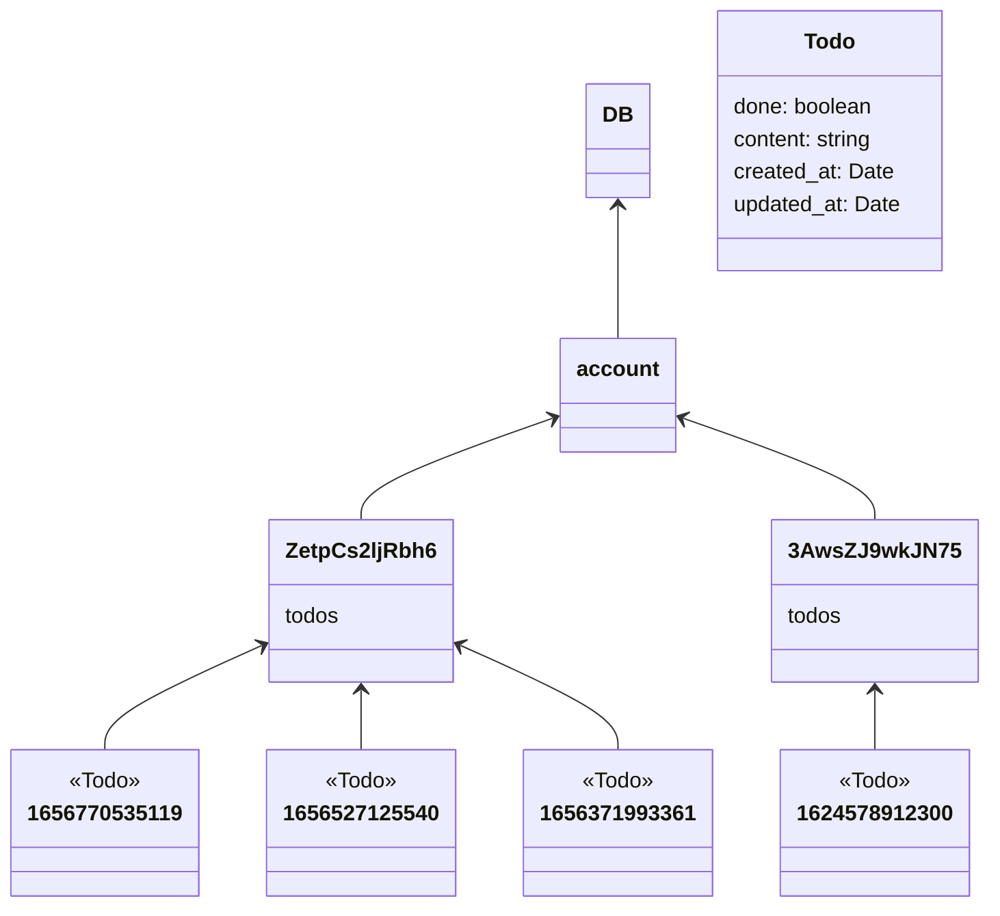

# CRA 로 만든, firebase 를 활용한 Todo 앱입니다

.env 파일을 만들어야합니다

```
REACT_APP_FIREBASE_API_KEY=
REACT_APP_FIREBASE_PROJECT_ID=
REACT_APP_FIREBASE_APP_ID=
```

위 값들을 채워야 동작합니다 <br/>
각 값들은 firebase 에서 찾을 수 있습니다

---

## 파이어스토어

### 구조

db 아래에는 accounts 컬렉션이 있고, uid(user-id)를 id로 하는 문서들을 갖고 있습니다 <br>
각 유저 문서들은 todos 컬렉션을 갖고 있으며 <br>
UNIX timestamp를 id로 갖는 todo 문서들이 존재합니다



### 파이어스토어 보안규칙

```
rules_version = '2';
service cloud.firestore {
  match /databases/{database}/{documents} {
    match /account/{uid=*} {
      allow read, write: if request.auth.uid == uid;
    }
    match /account/{uid=*}/todos/{todo=*} {
    	allow read, write: if request.auth.uid == uid;
    }
  }
}
```
